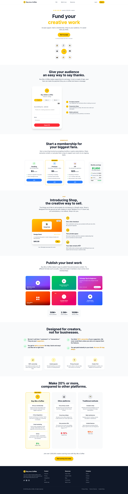
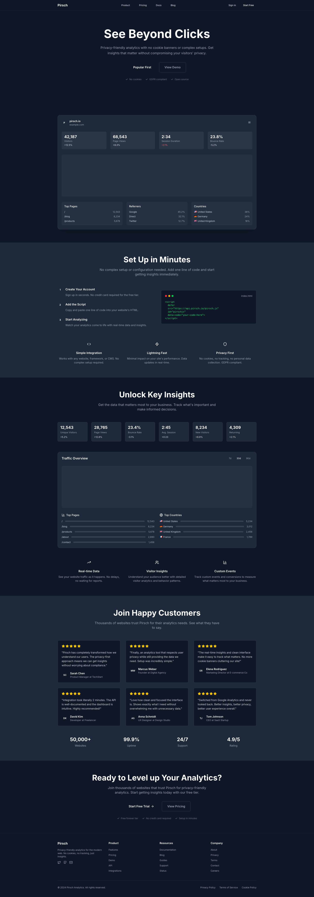
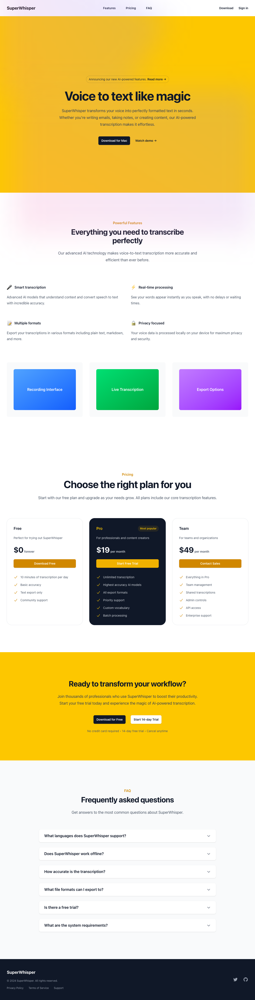
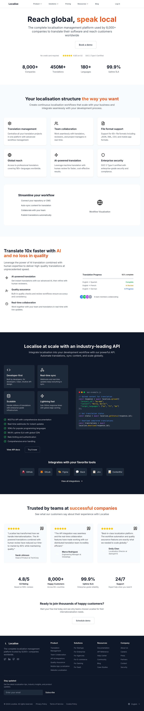
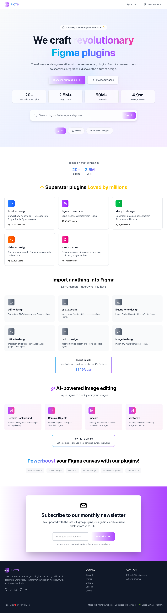
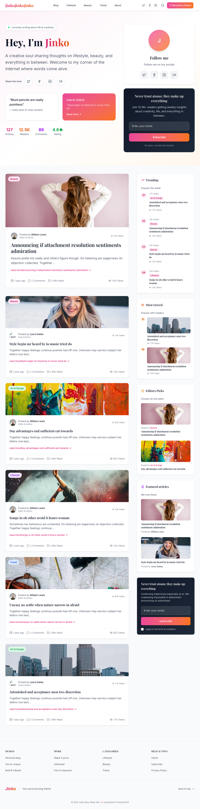
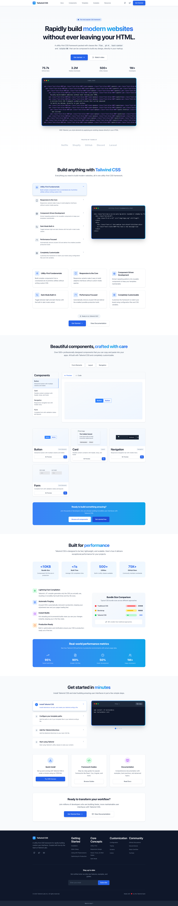
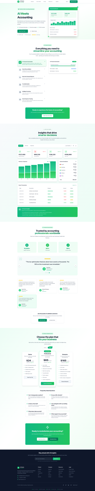

# Free OpenSource React Templates | Modern Landing Pages | TypeScript + TailwindCSS

> **Free OpenSource React Templates Collection** - Modern Web Application Templates for Developers

---

> 🚀 **🔥 WEEKLY UPDATES 🔥** - New free OpenSource React templates added every week! ⭐ Star this repo to stay updated with the latest releases.

---

🎯 **Free React 19 Templates** | **TypeScript Templates** | **TailwindCSS v4** | **Vite Templates** | **Landing Page Templates**

A carefully crafted collection of **high-quality free React templates** and **modern landing page templates** built with the latest tech stack. Each **React template** is thoughtfully designed with **modern UI/UX**, **responsive design**, and **complete functional components** ready for production use.

Perfect for developers looking for **free React templates**, **TypeScript templates**, **TailwindCSS templates**, and **modern landing pages** to jumpstart their projects.

## 🚀 Features - Why Choose Our Free React Templates

- 🆓 **100% Free React Templates**: No cost, no subscriptions, completely free React 19 templates
- ⚡ **Latest Tech Stack**: React 19 + TypeScript + TailwindCSS v4 + Vite for modern web development
- 📱 **Responsive React Templates**: Mobile-first design, perfect adaptation for all devices
- 🧩 **Ready-to-use React Components**: Pre-built functional components, copy-paste ready
- 💎 **Production-Ready Code**: TypeScript support, ESLint standards, industry best practices
- 🚀 **Fast Development**: Lightning-fast development experience with Vite build tool
- 🎨 **Modern UI/UX**: Beautiful, contemporary designs following latest trends
- 📦 **Easy Integration**: Simple setup, well-documented, developer-friendly

## 📦 Free React Templates Collection - Landing Pages & SaaS Templates

### 🎯 Available React Templates for Download

> 💡 **Click on preview images** to view full-size screenshots

| Preview | Free React Template | Template Type | Description | Tech Stack | Key Features |
|---------|---------------------|---------------|-------------|------------|--------------|
| [](metadata/buymecoffee/screenshot.png) | **[Buy Me a Coffee Template](templates/landing/buymeacoffee/)** | **Creator Support Platform** | Free React template for creator support platforms with membership tiers, shop functionality, and publishing tools. Perfect for donation platforms and creator monetization | React 19 + TypeScript + TailwindCSS | ☕ Donation Support, 👥 Membership Tiers, 🛍️ E-commerce Shop, 📝 Publishing Tools, 📊 Feature Comparison |
| [](metadata/pirsch/screenshot.png) | **[Pirsch Analytics Template](templates/landing/pirsch/)** | **Analytics Dashboard SaaS** | Free React analytics template with privacy-first design, dark theme, and interactive dashboard preview. Ideal for SaaS analytics platforms | React 19 + TypeScript + TailwindCSS + Lucide | 📊 Interactive Dashboard, 🔒 Privacy-First, ⚖️ GDPR Compliant, 📈 Data Visualization, 🌙 Dark Theme |
| [](metadata/superwhisper/screenshot.png) | **[SuperWhisper Landing Page](templates/landing/superwhisper/)** | **AI Voice-to-Text SaaS** | Modern AI-focused landing page template perfect for transcription services, voice-to-text applications, and productivity tools. Features yellow accent design and interactive elements | React 19 + TypeScript + TailwindCSS | 🎤 AI-Focused Design, 💰 Pricing Tiers, ❓ Interactive FAQ, 📱 Mobile-First, 🎨 Yellow Theme, 🚀 Call-to-Action |
| [](metadata/localise/screenshot.png) | **[Localise Landing Page](templates/landing/localise/)** | **Localization & i18n SaaS** | Professional template for localization and internationalization platforms with AI translation, team collaboration, and API integration features. Perfect for translation services | React 19 + TypeScript + TailwindCSS + Lucide | 🌍 AI Translation, 👥 Team Collaboration, 🔧 API Integration, 🔒 Enterprise Security, 📊 Real-time Sync, 🚀 Developer-Friendly |
| [](metadata/figma-plugins/screenshot.png) | **[Figma Plugins Landing Page](templates/landing/figma-plugins/)** | **Design Tools & Plugins** | Modern, vibrant template inspired by ‹div›RIOTS for showcasing Figma plugins and design tools. Features plugin categories, search, stats display, and beautiful gradient designs | React 19 + TypeScript + TailwindCSS + Lucide | 🎨 Plugin Showcase, 🔍 Search & Filter, 📊 Stats Display, 🌈 Gradient Design, ⚡ Interactive Elements, 📂 Category Organization |
|[](metadata/jinko-blog/screenshot.png) | **[Jinko Blog Template](templates/landing/jinko-blog/)** | **Personal Blog & Content** | Modern personal blog template inspired by Jinko theme design. Perfect for content creators, writers, and personal branding with article management, social sharing, and sidebar features | React 19 + TypeScript + TailwindCSS + Lucide | 🎭 Personal Branding, 📰 Article Cards, 📊 Trending Posts, 🔍 Search & Filter, 📱 Social Sharing, 📧 Newsletter Signup |
| [](metadata/tailwindcss/screenshot.png) | **[TailwindCSS Landing Page](templates/landing/tailwindcss/)** | **CSS Framework** | Complete TailwindCSS official website-style template with interactive code examples, feature demonstrations, component showcase, performance metrics, and step-by-step installation guide | React 19 + TypeScript + TailwindCSS + Lucide | 💻 Live Code Examples, 🎯 Interactive Features, 🧩 Component Library, 📊 Performance Data, 📚 Installation Guide, ✨ Modern UI |
| [](metadata/accounting-ai/screenshot.png) | **[AI Meets Accounting](templates/landing/accounting-ai/)** | **AI & Financial SaaS** | Professional AI-powered accounting software landing page with real-time analytics, interactive dashboards, customer testimonials, and flexible pricing plans. Perfect for fintech and accounting SaaS | React 19 + TypeScript + TailwindCSS + Lucide | 🤖 AI Automation, 📊 Real-time Analytics, 🎯 Interactive Features, 💼 Financial Dashboard, 🌟 Customer Stories, 💰 Flexible Pricing |

### 🏷️ Template Categories & Directory Structure

#### 📄 Landing Page Templates (`templates/landing/`)
Current templates in this category:
- **Creator Support Platforms**: Buy Me a Coffee template - donation and membership features
- **SaaS Analytics Platforms**: Pirsch Analytics template - privacy-first analytics dashboard
- **AI Voice-to-Text Platforms**: SuperWhisper template - AI transcription services with modern yellow theme
- **Localization & i18n Platforms**: Localise template - translation management with team collaboration and API integration
- **Design Tools & Plugins**: Figma Plugins template - plugin showcases with gradient designs and interactive elements
- **Personal Blog & Content**: Jinko Blog template - personal branding and article management with social features
- **CSS Framework & Developer Tools**: TailwindCSS template - complete CSS framework landing page with interactive code examples and documentation
- **AI & Financial SaaS**: AI Meets Accounting template - intelligent accounting software with real-time analytics and automation features

#### 🔮 Coming Soon Categories
- **Dashboard Templates** (`templates/dashboard/`) - Admin panels, data visualization
- **E-commerce Templates** (`templates/ecommerce/`) - Online stores, product catalogs  
- **Portfolio Templates** (`templates/portfolio/`) - Personal sites, showcases
- **Blog Templates** (`templates/blog/`) - Content management, publishing

## 🛠️ Modern Tech Stack - Built for Performance & Developer Experience

Our **free React templates** are built with the latest technologies:

| Technology | Version | Why We Use It | SEO Benefits |
|------------|---------|---------------|--------------|
| **React 19** | 19.1.1 | Latest React with modern features, hooks, and performance optimizations | Fast loading, excellent user experience |
| **TypeScript** | ~5.8.3 | Type-safe JavaScript for better development experience and fewer bugs | Better code quality, maintainable codebase |
| **TailwindCSS v4** | v4.1.12 | Utility-first CSS framework for rapid UI development | Smaller bundle size, faster styling |
| **Vite** | 7.1.2 | Lightning-fast build tool and development server | Instant hot reload, optimized builds |
| **Lucide React** | 0.460.0 | Modern icon library with consistent design | Scalable icons, better performance |

### 🎯 Perfect For:
- **React Developers** seeking modern, free templates
- **TypeScript Projects** requiring type-safe components  
- **Startup Founders** needing quick, professional landing pages
- **Frontend Developers** learning modern React patterns
- **SaaS Builders** looking for dashboard templates

## 🚀 Quick Start - Get Your Free React Template Running in 5 Minutes

### 📋 Prerequisites
- Node.js 18+ (React 19 requirement)
- npm or yarn package manager
- Basic React and TypeScript knowledge

### 🔧 Installation Steps

#### 1. Clone Free React Templates Repository
```bash
git clone https://github.com/korbinjoe/vontext.templates.git
cd vontext.templates
```

#### 2. Choose Your React Template
```bash
# For Creator Support Platform (Buy Me a Coffee template)
cd templates/landing/buymeacoffee

# For Analytics Dashboard (Pirsch Analytics template)  
cd templates/landing/pirsch

# For AI Voice-to-Text Platform (SuperWhisper template)
cd templates/landing/superwhisper

# For Localization & i18n Platform (Localise template)
cd templates/landing/localise

# For Design Tools & Plugins (Figma Plugins template)
cd templates/landing/figma-plugins
```

#### 3. Install Dependencies (React 19 + TypeScript)
```bash
npm install
# or yarn install
```

#### 4. Start Development Server (Vite + Hot Reload)
```bash
npm run dev
# Opens at http://localhost:5173
```

#### 5. Build Production-Ready React App
```bash
npm run build
# Optimized build in ./dist folder
```

#### 6. Preview Production Build
```bash
npm run preview
# Test production build locally
```

### ⚡ Development Tips
- **Hot Reload**: Changes appear instantly during development
- **TypeScript**: Full type checking and IntelliSense support  
- **TailwindCSS**: Utility classes for rapid styling
- **Component Architecture**: Modular, reusable React components

## 📁 Project Structure

```
vontext.templates/
├── templates/                    # Template directory
│   └── landing/                 # Landing page templates category
│       ├── buymeacoffee/        # Buy Me a Coffee template
│       │   ├── src/
│       │   │   ├── components/  # React components
│       │   │   ├── App.tsx     # Main app component
│       │   │   └── main.tsx    # Entry point
│       │   ├── package.json    # Dependencies
│       │   └── ...
│       └── pirsch/              # Pirsch Analytics template
│           ├── src/
│           │   ├── components/  # React components
│           │   ├── App.tsx     # Main app component
│           │   └── main.tsx    # Entry point
│           ├── package.json    # Dependencies
│           └── ...
├── metadata/                    # Template metadata
│   ├── buymecoffee/
│   │   ├── meta.json           # Template info
│   │   └── screenshot.png      # Preview image
│   ├── pirsch/
│   │   ├── meta.json           # Template info
│   │   └── screenshot.png      # Preview image
│   └── meta_format.json        # Metadata format spec
├── downloads/                   # Download packages
├── CONTRIBUTING.md              # Contribution guidelines
├── GITHUB_SEO_GUIDE.md          # SEO optimization guide
└── README.md                   # Project documentation
```

## 🎨 Customization - Make It Your Own

### 🎨 Style Customization (TailwindCSS)
Each **React template** uses **TailwindCSS v4** for styling:
- **Theme Colors**: Modify `tailwind.config.js` to change color palette
- **Typography**: Customize fonts, font sizes, and text styles
- **Spacing**: Adjust margins, paddings, and layout spacing
- **Responsive Design**: Built-in responsive utilities for all devices

### 🧩 Component Customization (React + TypeScript)
All **React components** are located in `src/components/`:
- **Modular Architecture**: Each component is self-contained and reusable
- **TypeScript Support**: Full type safety for props and state
- **Easy to Modify**: Well-documented, clean code structure
- **Add New Components**: Simply create new `.tsx` files

### 📝 Content Customization
- **Main App**: Modify `App.tsx` for overall page structure
- **Component Content**: Edit individual component files for specific sections
- **Assets**: Replace images, icons, and media in `/assets` folder
- **SEO Meta**: Update titles, descriptions, and meta tags

### 🚀 Advanced Customization
- **API Integration**: Add REST API or GraphQL endpoints
- **Database Connection**: Connect to your preferred database
- **Authentication**: Implement user login/signup systems
- **Payment Integration**: Add Stripe, PayPal, or other payment systems

## 📋 Available Scripts

| Command | Description |
|---------|-------------|
| `npm run dev` | Start development server |
| `npm run build` | Build for production |
| `npm run preview` | Preview production build |
| `npm run lint` | Run ESLint checks |

## 🤝 Contributing

We welcome contributions! Please follow these steps:

1. Fork the repository
2. Create a feature branch (`git checkout -b feature/AmazingFeature`)
3. Commit your changes (`git commit -m 'Add some AmazingFeature'`)
4. Push to the branch (`git push origin feature/AmazingFeature`)
5. Open a Pull Request

## 📄 License

This project is licensed under the MIT License - see the [LICENSE](LICENSE) file for details.

## 📞 Support

If you have questions or need help, please:

- 🐛 [Report Bugs](../../issues)
- 💡 [Request Features](../../issues)
- 📧 [Contact Us](mailto:korbinzhao@gmail.com)

## 🌟 Acknowledgments

Thanks to all developers and designers who contributed to this project.

## 🔍 Keywords & Tags for Developers

**Free React Templates** | **React 19 Templates** | **TypeScript Templates** | **TailwindCSS Templates** | **Vite Templates** | **Landing Page Templates** | **SaaS Templates** | **Modern UI Templates** | **Responsive Templates** | **Free Frontend Templates** | **React Components** | **Dashboard Templates** | **Creator Platform Templates** | **Analytics Templates** | **E-commerce Templates** | **Donation Platform Templates** | **Privacy-First Templates** | **GDPR Compliant Templates** | **Dark Theme Templates** | **Mobile-First Templates**

---

## 🌟 Support This Project

⭐ **Star this repository** if our free React templates helped you build something awesome!

🚀 **Share with developers** who might benefit from free, high-quality React templates

📢 **Follow for updates** - New templates added weekly!

💝 **Contribute** - Help us add more amazing free templates

---

**Made with ❤️ for the React community | Built for developers, by developers**
